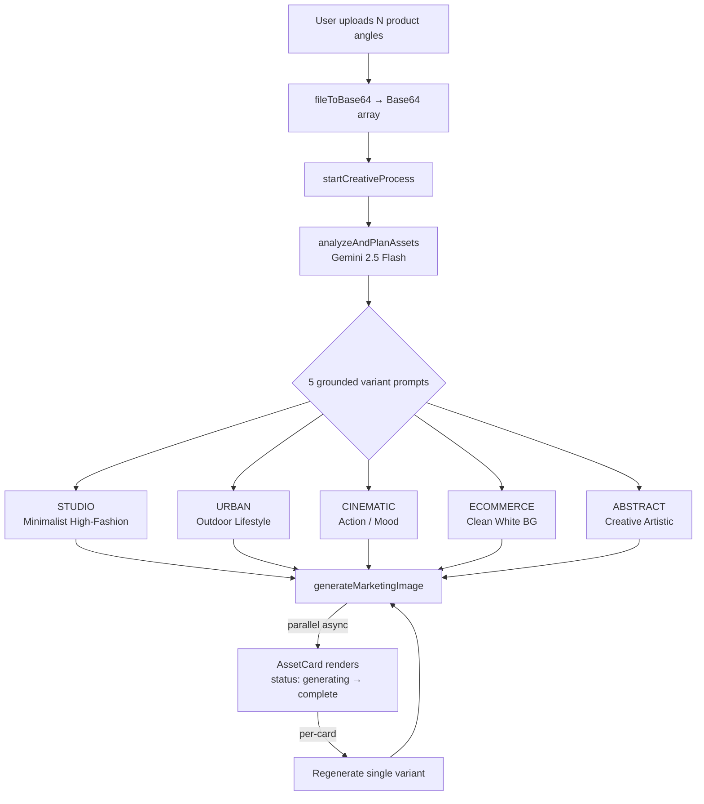

<div align="center">

# Neha Chappal Creative Suite

### Production-grade AI creative pipeline that replaced a footwear retailer's photography agency — collapsing a 2-day shoot cycle into a 20-minute, 5-variant marketing batch.

[](https://github.com/yatinbhalla/Neha-Chappal-Creative-Suite)
[](https://ai.google.dev/)
[](#-tech-stack)
[](https://github.com/yatinbhalla/Neha-Chappal-Creative-Suite/commits/main)
[](https://github.com/yatinbhalla/Neha-Chappal-Creative-Suite)
[](https://github.com/yatinbhalla/Neha-Chappal-Creative-Suite/pulls)

**[ Live App ](https://ai.studio/apps/drive/1iHn72r9TKpf17lKYDY0Qef_sLjuuaUEX?fullscreenApplet=true)** · **[ Report Issue ](https://github.com/yatinbhalla/Neha-Chappal-Creative-Suite/issues)** · **[ Author ](https://github.com/yatinbhalla)**

</div>

> _Demo GIF and screenshots coming soon — open an issue if you'd like to contribute one._

---

## Table of Contents

- [Overview](#-overview)
- [Key Features](#-key-features)
- [Business Impact](#-business-impact)
- [Tech Stack](#%EF%B8%8F-tech-stack)
- [Project Layout](#%EF%B8%8F-project-layout)
- [Application State](#-application-state)
- [AI Routing & Prompt Architecture](#-ai-routing--prompt-architecture)
- [Components](#-components)
- [Utilities](#-utilities)
- [Getting Started](#-getting-started)
- [Known Limitations & Roadmap](#%EF%B8%8F-known-limitations--roadmap)
- [Contributing](#-contributing)
- [Author](#author)

---

## 🚀 Overview

**Identified** a recurring ₹15,000+/month bottleneck for a real footwear retail business (Neha Chappal Store) — product photography for Flipkart, Amazon, Meesho, and Instagram listings was outsourced to an agency on a 2-day turnaround, blocking new SKU launches and starving social campaigns.

**Architected and shipped** a single-page React + Gemini 2.5 Flash creative pipeline that ingests multiple product angles, runs a multimodal analysis pass to plan five distinct campaign variants, then generates them in parallel — replacing the agency workflow end-to-end.

**Deployed to production** and used weekly by the store's operator. Cut creative turnaround from **2 days → ~20 minutes per product batch** while eliminating the recurring agency spend.

---

## 🧩 Key Features

- **Architected a 5-variant campaign generator** — Studio, Urban Lifestyle, Cinematic Mood, Clean E-commerce, and Creative Abstract — so a single SKU yields a full marketplace + social asset set in one run.
- **Engineered multi-angle multimodal ingestion** — uploads N product photos as Base64 references; Gemini analyzes all angles jointly to ground every generated variant in the real product geometry.
- **Productionized parallel image generation** — fires all five `generateMarketingImage` calls concurrently after the planning pass, so wall-clock time is bounded by the slowest variant, not the sum.
- **Shipped a stateful asset board** — per-asset status machine (`pending → generating_image → complete | error`) renders live progress and per-card regeneration without re-running analysis.
- **Optimized for Indian e-commerce stack** — variants designed to clear Flipkart / Amazon / Meesho listing standards and Instagram-ready compositions in the same batch.
- **Validated against real revenue workflow** — replaces a live agency line item, not a synthetic benchmark.

---

## 📈 Business Impact

| Metric | Before | After | Δ |
| --- | --- | --- | --- |
| Creative turnaround per batch | ~2 days | ~20 minutes | **~99% reduction** |
| Monthly agency spend | ₹15,000+ | ₹0 | **100% eliminated** |
| Variants per shoot | 1 style | 5 styles | **5× breadth** |
| Marketplace listing CTR / conversion lift | — | _Pending validation_ | _To be measured_ |
| First-pass generation acceptance rate | — | — | ~70% first-pass usable |

> _Outcome metrics flagged "Pending validation" are currently being instrumented — see the Author section to ping for the updated numbers._

---

## ⚙️ Tech Stack

**Frontend**


**AI / ML**


**Tooling**


**Deployment**


---

## 🗺️ Project Layout

```
Neha-Chappal-Creative-Suite/
├── components/
│   └── AssetCard.tsx        # Per-variant render: status, image, regenerate, errors
├── services/
│   └── geminiService.ts     # Gemini orchestration — analyzeAndPlanAssets + generateMarketingImage
├── App.tsx                  # Single-page controller: upload → analyze → parallel generate → render
├── index.tsx                # React 19 root + mount
├── index.html               # Vite entry shell
├── types.ts                 # VariantType enum (5 campaign styles) + GeneratedAsset state
├── utils.ts                 # fileToBase64 helper
├── metadata.json            # AI Studio app manifest
├── vite.config.ts           # Port 3000, GEMINI_API_KEY env injection, @ alias
├── tsconfig.json            # TS 5.8 strict config
└── package.json             # React 19.2 · @google/genai 1.34 · uuid 13 · Vite 6
```

<details>
<summary><b>Why this shape?</b> (click to expand)</summary>

The project is intentionally flat — a builder-grade single-page app, not an over-engineered monorepo. `App.tsx` owns the workflow state. `services/` isolates every Gemini call behind two pure functions so swapping models (e.g., Gemini → Veo for v2 video) is a one-file change. `types.ts` centralizes the variant taxonomy so the prompt planner, UI tabs, and asset state machine can never drift apart.

</details>

---

## 🧠 Application State

State lives in `App.tsx` as plain React 19 hooks — no Redux, no Context, no Zustand. Five `useState` slices coordinate the entire workflow:

| State | Type | Purpose |
| --- | --- | --- |
| `sourceImages` | `string[]` | Base64 of every uploaded product angle (multi-angle multimodal input) |
| `activeImageIndex` | `number` | Currently previewed angle in the source panel |
| `isAnalyzing` | `boolean` | Drives the loading state during the Gemini planning pass |
| `assets` | `GeneratedAsset[]` | Array of 5 variant assets, each with its own status machine |
| `error` | `string \| null` | Surfaces analysis / generation failures to the UI |

The mutation surface is exactly three callbacks — `handleFileUpload`, `startCreativeProcess`, and a memoized `updateAsset` — keeping the state graph trivial to reason about and to extend.

---

## 🧠 AI Routing & Prompt Architecture

The pipeline is a two-stage multimodal orchestration: **plan once, generate in parallel.**



**Stage 1 — Plan (`analyzeAndPlanAssets`)**
One Gemini 2.5 Flash call ingests *all* uploaded product angles together. The model returns a `Record<VariantType, prompt>` map — five purpose-built generation prompts grounded in the real product's color, geometry, and material.

**Stage 2 — Generate (`generateMarketingImage`)**
Fired in a non-awaited `for` loop after planning, so all five variants render concurrently. Each call passes the reference images + the planner's prompt back to Gemini's image surface.

**Error containment**
A failure in any single variant flips only that asset's status to `error` and surfaces the message on its card — the other four continue. Per-card "Regenerate" lets the operator retry without re-running the planner.

**Variant taxonomy** lives in `types.ts` as a single `enum VariantType`, so adding a sixth campaign style (e.g., "Festival Diwali Edition") is a one-line type change followed by a planner prompt update — no UI rewiring.

---

## 🧩 Components

| Component | File | Responsibility |
| --- | --- | --- |
| `App` | `App.tsx` | Top-level controller; owns workflow state, upload, orchestration |
| `AssetCard` | `components/AssetCard.tsx` | Per-variant card: status spinner, generated image, prompt display, regenerate, error surface |

Tailwind utility classes handle all styling — no CSS files, no styled-components, no class-name churn.

---

## 🔧 Utilities

| Helper | File | Purpose |
| --- | --- | --- |
| `fileToBase64` | `utils.ts` | Promise wrapper over `FileReader.readAsDataURL` — converts uploaded `File` objects into Base64 strings the Gemini SDK accepts directly |
| `generateId` | `App.tsx` | Lightweight ID for asset list keys (deliberately not a dep on `uuid` here) |

---

## 🚀 Getting Started

**Prerequisites**

- Node.js **22+**
- A **Google AI Studio API key** with Gemini 2.5 Flash access ([get one here](https://aistudio.google.com/apikey))

**Install & run**

```bash
# 1. Clone
git clone https://github.com/yatinbhalla/Neha-Chappal-Creative-Suite.git
cd Neha-Chappal-Creative-Suite

# 2. Install dependencies
npm install

# 3. Set your Gemini API key
echo "GEMINI_API_KEY=your_key_here" > .env.local

# 4. Run dev server (Vite, http://localhost:3000)
npm run dev

# 5. Build for production
npm run build

# 6. Preview production build
npm run preview
```

<details>
<summary><b>Environment variables</b></summary>

| Variable | Required | Notes |
| --- | --- | --- |
| `GEMINI_API_KEY` | ✅ | Injected at build-time by Vite as both `process.env.API_KEY` and `process.env.GEMINI_API_KEY` (see `vite.config.ts`). |

</details>

---

## ⚠️ Known Limitations & Roadmap

**Today's honest scope**

- Image-only pipeline — **Veo-based short video generation** is on the roadmap, not yet wired into the app.
- **Auto-watermarking with the store's brand logo** is planned for v2; today's outputs are unwatermarked.
- Single API key — no per-user auth, no rate-limit handling beyond Gemini's own.
- No persistent history — generated assets live only in the current session and must be downloaded before refresh.
- No A/B framework — variant performance has to be measured manually on each marketplace.

**v2 ideas**

- **Veo integration** for 5–10 second product hero videos from the same source angles.
- **Brand watermark + logo overlay pass** between Gemini output and download.
- **Saved campaign history** with Supabase / Firestore so the operator can revisit past batches.
- **Marketplace-direct export** — push approved variants straight to Flipkart Seller Hub / Amazon SellerCentral via their APIs.
- **Conversion-lift telemetry** — wire UTM-tagged listings back to the app to close the feedback loop.

---

## 🤝 Contributing

Issues, PRs, and product critiques are warmly welcome — especially from PMs, founders, and creative tooling builders who've shipped against the same agency-cost problem.

- **Bug or feature idea?** → [Open an issue](https://github.com/yatinbhalla/Neha-Chappal-Creative-Suite/issues/new)
- **Want to extend a variant or wire Veo?** → Fork and open a PR; happy to review on the same day
- **Using this for your own retail business?** → Ping me on LinkedIn, I'd love to hear what worked and what didn't

This started as a one-store problem; if it can save another small retailer ₹15K/month, even better.

---

## Author

**Yatin Bhalla** · Product Manager & AI Product Builder

[](https://linkedin.com/in/yatinbhalla42)
[](mailto:yatinbhalla42@gmail.com)
[](https://x.com/yatinbhalla42)
